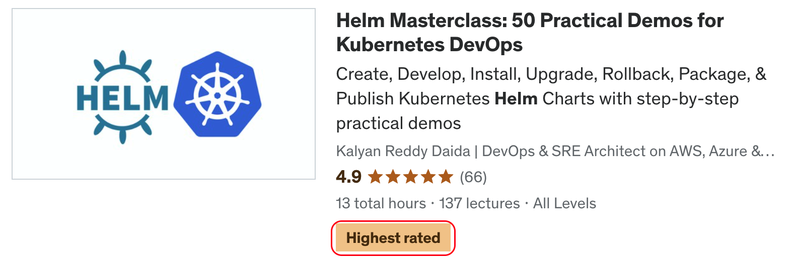

# [Helm Masterclass: 50 Practical Demos for Kubernetes DevOps](https://stacksimplify.com/courses/helm-masterclass/)

## [Course Details](https://stacksimplify.com/courses/helm-masterclass/)
- **Title:** [Helm Masterclass: 50 Practical Demos for Kubernetes DevOps](https://stacksimplify.com/courses/helm-masterclass/)
- **Subtitle:** Create, Develop, Install, Upgrade, Rollback, Package, and Publish Helm Charts with step-by-step practical demos.

## [Course Modules](https://stacksimplify.com/courses/helm-masterclass/)
01. Install Docker Desktop and HelmCLI
02. Helm Install
03. Helm Upgrade with set option
04. Helm Upgrade with Chart Versions
05. Helm Uninstall Keep History
06. Helm Install Generated Name
07. Helm Install Atomic
08. Helm with Namespaces
09. Helm Override Values
10. Helm Chart Structure
11. Helm Dev BuiltIn Objects
12. Helm Dev Basics
13. Helm Dev If Else EQ
14. Helm Dev If Else AND BOOLEAN
15. Helm Dev If Else OR
16. Helm Dev If Else NOT
17. Helm Dev WITH
18. Helm Dev WITH If Else
19. Helm Dev Variables
20. Helm Dev Range List
21. Helm Dev Range Dict
22. Helm Dev Named Templates
23. Helm Dev Printf Function
24. Helm Dev call template in template
25. Helm Create and Package Chart
26. Helm Dependency
27. Helm Dependency Alias
28. Helm Dependency Condition
29. Helm Dependency Condition Alias
30. Helm Dependency Tags
31. Helm Dependency Override Subchart Values
32. Helm SubChart Global Values
33. Helm Dependency Import Values Explicit
34. Helm Dependency Import Values Implicit
35. Helm Starters
36. Helm Plugins
37. Helm Plugins Build
38. Helm Hooks
39. Helm Hooks Delete Policy
40. Helm Hook Weights
41. Helm Tests
42. Helm Resource Policy
43. Helm Sign and Verify Charts
44. Helm Repo on GitHub
45. Integrate with ArtifactHub
46. Helm Values Validate with JSON Schema

## [What will students learn in your course?](https://stacksimplify.com/courses/helm-masterclass/)
- You will master all 24 Helm commands, along with their respective subcommands and flags, through multiple practical demonstrations.
- You will learn how to develop Helm Charts through 13 Helm development demos.
- You will learn flow control actions such as If-else, With, and Range, in combination with functions like EQ, AND, BOOLEAN, OR, NOT, DEFAULT, and QUOTE.
- You will learn to create, package, install, upgrade, rollback, and uninstall Helm Charts.
- You will learn to implement Helm Dependency through 9 demos, which cover Alias, Condition, Tags, Global Values, and Import values.
- You will learn Helm concepts such as starters, plugins, hooks, tests, resource policy, and Values JSON Schema through practical demos
- You will learn to implement Helm Chart signing and verification.
- You will learn how to create a Helm Repository on GitHub and integrate it with Artifact Hub. 

## [What are the requirements or prerequisites for taking your course?](https://stacksimplify.com/courses/helm-masterclass/)
- You must have Kubernetes knowledge and experience to follow with me for hands-on activities.

## [Who is this course for?](https://stacksimplify.com/courses/helm-masterclass/)
- This course is designed for students who have completed my AWS EKS, Azure AKS, or Google GKE Kubernetes courses.
- Infrastructure Architects or Sysadmins or Developers or DevOps Engineers who are planning to master Helm.

## [Github Repositories used for this course](https://stacksimplify.com/courses/helm-masterclass/)
- [helm-masterclass](https://github.com/stacksimplify/helm-masterclass)
- [helm-charts](https://github.com/stacksimplify/helm-charts)
- [helm-charts-repo](https://github.com/stacksimplify/helm-charts-repo)
- [Course Presentation](https://github.com/stacksimplify/helm-masterclass/course-presentation/)
- **Important Note:** Please go to these repositories and FORK these repositories and make use of them during the course.

## [Each of my courses come with](https://stacksimplify.com/courses/helm-masterclass/)
- Amazing Hands-on Step By Step Learning Experiences
- Practical demos for each and every concept
- Friendly Support in the Q&A section
- "30-Day "No Questions Asked" Money Back Guaranteed by Udemy"

## My Other AWS Courses
- [Udemy Enroll](https://www.stacksimplify.com/azure-aks/courses/stacksimplify-best-selling-courses-on-udemy/)

## Instructor Profile
- [Kalyan Reddy Daida - StackSimplify](https://stacksimplify.com/about/)

# HashiCorp Certified: Terraform Associate - 50 Practical Demos
 

# AWS EKS - Elastic Kubernetes Service - Masterclass

# Azure Kubernetes Service with Azure DevOps and Terraform 

# Terraform on AWS with SRE & IaC DevOps | Real-World 20 Demos

# Azure - HashiCorp Certified: Terraform Associate - 70 Demos

# Terraform on Azure with IaC DevOps and SRE | Real-World 25 Demos

# [Terraform on AWS EKS Kubernetes IaC SRE- 50 Real-World Demos](https://stacksimplify.com/courses/terraform-aws-eks/)

---

## My Other Courses (383,000+ Students, 20 Courses)

> All courses available at [stacksimplify.com/courses](https://stacksimplify.com/courses/)

### AWS Courses

| Course | Students | Rating |
|--------|----------|--------|
| [AWS EKS Kubernetes Masterclass](https://stacksimplify.com/courses/aws-eks-masterclass/) | 70,041+ | 4.6 (5,495 ratings) |
| [AWS VPC Transit Gateway](https://stacksimplify.com/courses/aws-vpc-transit-gateway/) | 52,243+ | 4.6 (790 ratings) |
| [Terraform on AWS with SRE and IaC DevOps](https://stacksimplify.com/courses/terraform-on-aws-sre/) | 31,006+ | 4.6 (3,347 ratings) |
| [Terraform on AWS EKS Kubernetes IaC SRE](https://stacksimplify.com/courses/terraform-aws-eks/) | 26,929+ | 4.5 (2,238 ratings) |
| [HashiCorp Certified: Terraform Associate (AWS)](https://stacksimplify.com/courses/hashicorp-terraform-associate-aws/) | 16,835+ | 4.6 (1,754 ratings) |
| [AWS CloudFormation Simplified](https://stacksimplify.com/courses/aws-cloudformation/) | 16,223+ | 4.3 (1,469 ratings) |
| [AWS Fargate and ECS Masterclass](https://stacksimplify.com/courses/aws-fargate-ecs/) | 15,208+ | 4.4 (1,051 ratings) |
| [AWS CodePipeline CI/CD](https://stacksimplify.com/courses/aws-codepipeline/) | 9,832+ | 4.0 (966 ratings) |
| [AWS Elastic Beanstalk Master Class](https://stacksimplify.com/courses/aws-elastic-beanstalk/) | 7,588+ | 4.3 (373 ratings) |
| [Ultimate DevOps Real-World Project on AWS](https://stacksimplify.com/courses/ultimate-devops-real-world-project-on-aws/) | 4,772+ | 4.72 (358 ratings) |

### Azure Courses

| Course | Students | Rating |
|--------|----------|--------|
| [Azure Kubernetes Service with Azure DevOps and Terraform](https://stacksimplify.com/courses/azure-aks-devops-terraform/) | 48,551+ | 4.6 (6,196 ratings) |
| [Terraform on Azure with IaC DevOps SRE](https://stacksimplify.com/courses/terraform-on-azure/) | 17,918+ | 4.7 (1,911 ratings) |
| [Azure HashiCorp Certified: Terraform Associate](https://stacksimplify.com/courses/hashicorp-terraform-associate-azure/) | 16,938+ | 4.5 (1,985 ratings) |
| [Azure Kubernetes Service AGIC Ingress](https://stacksimplify.com/courses/azure-aks-agic/) | 2,012+ | 4.6 (112 ratings) |

### GCP Courses

| Course | Students | Rating |
|--------|----------|--------|
| [GCP Google Kubernetes Engine GKE with DevOps](https://stacksimplify.com/courses/gcp-gke-kubernetes/) | 8,769+ | 4.4 (779 ratings) |
| [GCP Associate Cloud Engineer Certification](https://stacksimplify.com/courses/gcp-associate-cloud-engineer/) | 6,007+ | 4.6 (599 ratings) |
| [GCP Terraform on Google Cloud](https://stacksimplify.com/courses/gcp-terraform/) | 2,600+ | 4.4 (213 ratings) |
| [GCP GKE Terraform on Google Kubernetes Engine](https://stacksimplify.com/courses/gcp-gke-terraform/) | 2,040+ | 4.6 (155 ratings) |

### DevOps and General

| Course | Students | Rating |
|--------|----------|--------|
| [Helm Masterclass: 50 Practical Demos](https://stacksimplify.com/courses/helm-masterclass/) | 12,069+ | 4.7 (915 ratings) |
| [Docker in a Weekend: 40 Practical Demos](https://stacksimplify.com/courses/docker-weekend/) | 3,802+ | 4.6 (361 ratings) |

---

## Instructor Profile
- [Kalyan Reddy Daida - StackSimplify](https://stacksimplify.com/about/)

---

## Connect with Me
- [YouTube - Cloud & DevOps Tutorials](https://www.youtube.com/@stacksimplify)
- [LinkedIn - Kalyan Reddy](https://www.linkedin.com/in/kalyan-reddy/)
- [GitHub - StackSimplify](https://github.com/stacksimplify)

---

